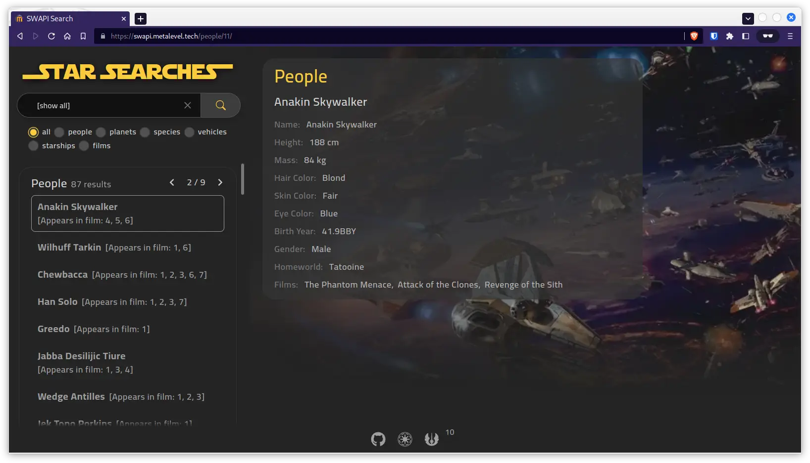

# [](https://swapi.metalevel.tech/)

**_SWAPI Search App with ReactJs and TypeScript._**

## Resources and referens

- [Star Wars API](https://swapi.dev/)

- [Star Wars API Alternative](https://swapi.py4e.com/about) [Currently in use because is much faster and up to date than the official one.]

- Related:

  - [SW Guide Site](https://starwars-visualguide.com/)
  - [SW Guide GitHub](https://github.com/tbone849/star-wars-guide/tree/master/build/assets/img)
  - [SWAPI Json Server GitHub](https://github.com/johnlindquist/swapi-json-server/tree/master/public)

  - <https://starwars.fandom.com/wiki/Obi-Wan_Kenobi_(television_series)>

- [Star Jedi Font](https://www.dafont.com/star-jedi.font)

- [Font Converter](https://cloudconvert.com/ttf-converter)

- [`UseHooks-TS`](https://usehooks-ts.com/) a React hooks library, ready to use, written in typescript.

## Notes

- To handle the pagination of search results per category, I just need to modify/replace the relevant object in the `searchResults` state.
- Invalidate selected search entry on new search?!?
- I should set browser's state instead using local storage, thus I can use the browser's back button to go back to the previous state and read the last state on page reload...

## Setup the Project

<details>

### Install ReactJs and Typescript by [Vite](https://vitejs.dev/guide/why.html)

```bash
npm create vite@latest
# ✔ Project name: … prj-ts-react-swapi
# ✔ Select a framework: › React
# ✔ Select a variant: › TypeScript
cd prj-ts-react-swapi/
npm install
npm i react-router-dom axios dompurify @types/dompurify
npm i usehooks-ts
```

- Create start command in [`package.json`](package.json) file as follows:

  ```json
  "scripts": {
      "start": "vite --host 0.0.0.0 --port 3000",
  }
  ```

- Clean the `src/` and `public/` directories and start working on the project.

### Install other packages

```bash
npm i --save-dev tailwindcss postcss autoprefixer postcss-import
npx tailwindcss init -p
```

```bash
npm i @tailwindcss/forms @tailwindcss/typography @tailwindcss/aspect-ratio
npm i @headlessui/react
npm i @heroicons/react
npm i react-icons
```

**References:**

- <https://tailwindui.com/>
- <https://react-icons.github.io/react-icons/>
- <https://headlessui.com/>
- <https://heroicons.com/>

### Setup the Git Repository and Push to GitHub

```bash
# git config --global init.defaultBranch master
git init
git add -A
git commit -m "Initial commit"
git branch -M master
git remote add origin git@github.com:metalevel-tech/prj-ts-react-swapi.git
git push -u origin master
```

### Automation with GitHub Actions

- [Deploy to GitHub Pages and Automate with GitHub Actions](https://github.com/metalevel-tech/exc-js-react-tic-tac-toe#deploy-to-github-pages-with-github-actions)

- [Deploying by `gh-pages` seems to overwrite custom domain](https://github.com/tschaub/gh-pages/issues/213) | [`gh-pages -d dist` overwrites custom domain](https://github.com/tschaub/gh-pages/issues/127)

- [Vite: Building for production](https://vitejs.dev/guide/build.html#public-base-path)

</details>

## Shell helpers

PNG > WebP conversion:

```bash
FILE="Input_image.png"
convert "$FILE" -quality 80 -strip -define webp:lossless=true -define webp:method=4 "${FILE%.*}_80.webp"
convert "$FILE" -quality 70 -strip -define webp:lossless=false -define webp:method=4 "${FILE%.*}_70.webp"
```

SVG > ICO conversion:

```bash
FILE="Input_image.svg"
convert -background transparent "$FILE" -clone 0 -resize 32x32  favicon.ico
```
